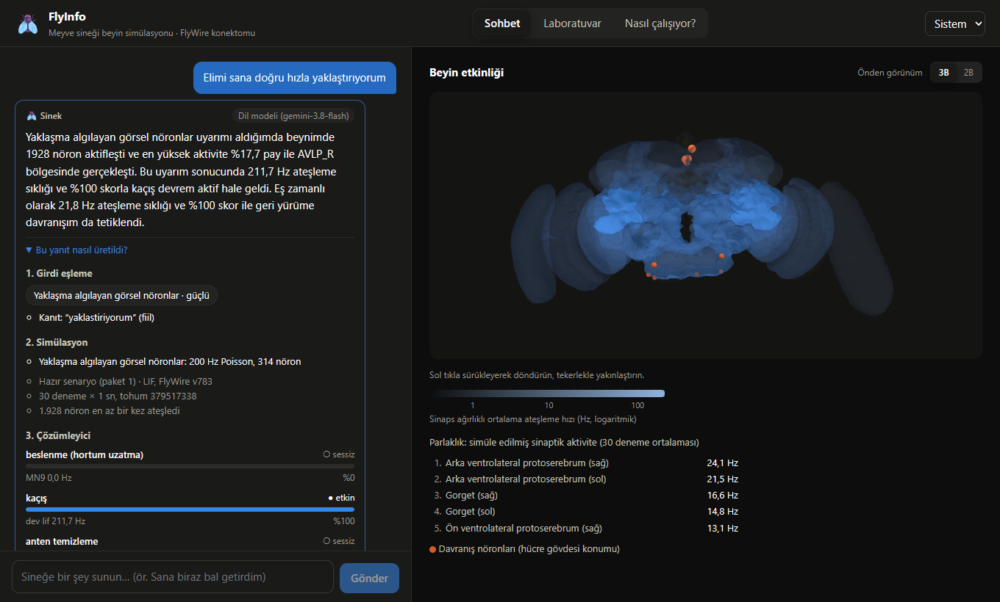
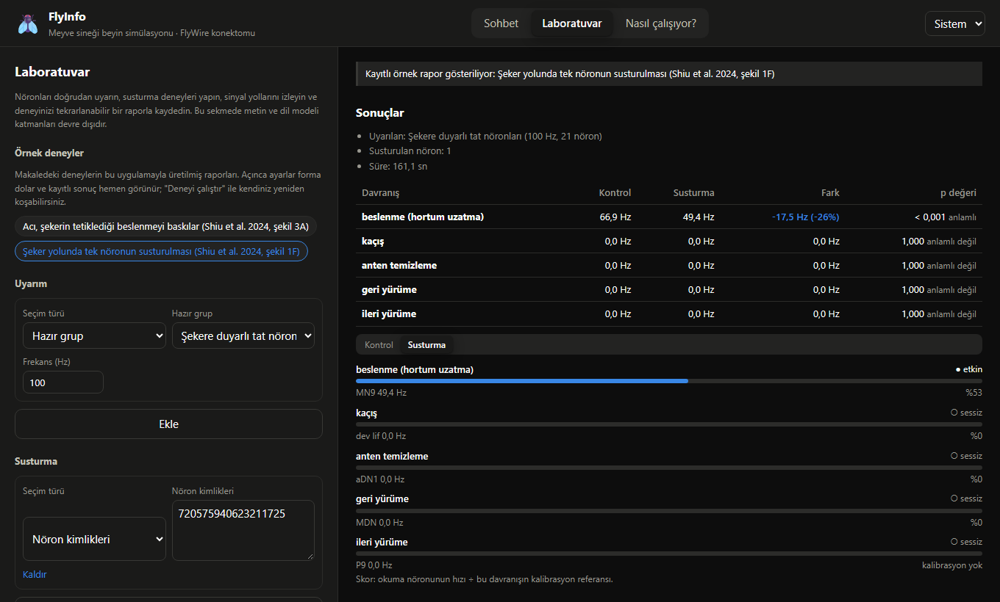

# FlyInfo 🪰

**Meyve sineğinin gerçek beyin haritası üzerinde çalışan, Türkçe ve bilimsel olarak şeffaf bir tam beyin simülasyonu.**

FlyInfo'da bir meyve sineğine (*Drosophila melanogaster*) "Sana biraz bal getirdim" gibi bir mesaj yazarsınız. Mesaj sineğin gerçek tat, dokunma, görme ya da koku nöronlarına verilen bir uyarıma çevrilir. Bu uyarımın 138.639 nöronluk beyinde nasıl yayıldığı simüle edilir ve sonuç, davranışla nedensel ilişkisi deneysel olarak gösterilmiş nöronlardan okunur: beslenme, kaçış, anten temizleme, geri ya da ileri yürüme.

> **Sinek dil anlamaz; bu bir sohbet botu değildir.** Gördüğünüz yanıt bir simülasyon ölçümüdür. Her adımın ne yaptığı arayüzde açıkça gösterilir ve metin yalnızca bu ölçümü dile getirir.



## İçindekiler

- [Neler yapabilirsiniz?](#neler-yapabilirsiniz)
- [Kurulum](#kurulum)
- [Dil modeli (isteğe bağlı)](#dil-modeli-isteğe-bağlı)
- [Nasıl çalışır?](#nasıl-çalışır)
- [Bilimsel doğrulama](#bilimsel-doğrulama)
- [Sınırlılıklar ve açıklamalar](#sınırlılıklar-ve-açıklamalar)
- [Sonuçları kendiniz yeniden üretin](#sonuçları-kendiniz-yeniden-üretin)
- [Sık sorulan sorular](#sık-sorulan-sorular)
- [Geliştirme](#geliştirme)
- [Veri, atıf ve lisans](#veri-atıf-ve-lisans)
- [English summary](#english-summary)

## Neler yapabilirsiniz?

### Sohbet

- Sineğe bir şey "sunun": *"Önüne bir kavanoz bal koydum"*, *"Elimi sana doğru hızla yaklaştırıyorum"*, *"Antenlerine üfledim"*.
- Beynin hangi bölgelerinin etkinleştiğini **döndürülebilir 3B beyin** üzerinde görün. 2B önden görünüm de var.
- Her yanıtın altındaki **"Bu yanıt nasıl üretildi?"** panelinde dört katmanın ara çıktılarını inceleyin: mesajın nasıl yorumlandığı, uyarılan nöronlar, davranış okumaları ve ham veri.
- Sinekte karşılığı olmayan mesajlarda ("kuru fasulye") uyarım uygulanmadığı açıkça söylenir.

### Laboratuvar



- Nöronları hazır gruptan, hücre tipiyle (ör. `LB3`, `DNp01`), nörotransmitterle, beyin bölgesiyle ya da tek tek kimlikle seçip istediğiniz frekansta **uyarın**.
- Seçtiğiniz nöronları **susturun**. Kontrol ve deney aynı tohumla koşulur; her davranışın değişimi istatistiksel anlamlılıkla gösterilir.
- Uyarılan nörondan davranış nöronuna giden **en güçlü sinyal yollarını** hücre tipi adlarıyla izleyin.
- Deneyi tüm ayarlarıyla **tek bir rapor dosyasına** kaydedin. Rapor başka bir bilgisayarda yüklendiğinde deney yeniden koşulur ve sonucun birebir tuttuğu doğrulanır.
- **Örnek deneyler**, makaledeki deneylerin bu uygulamayla üretilmiş sonuçlarını tek tıkla açar.

### Nasıl çalışıyor?

Uygulamanın içindeki sayfa yöntemi, sınırlılıkları, terimleri ve kaynakçayı Türkçe anlatır.

## Kurulum

FlyInfo kendi bilgisayarınızda çalışır; hesap, sunucu ya da API anahtarı gerekmez.

**Gereksinimler**

| | En az | Önerilen |
|---|---|---|
| İşletim sistemi | Windows 10+, Linux (x86-64), macOS 14+ (Apple Silicon) | — |
| Bellek | 8 GB | 16 GB |
| Disk | ~4 GB (çoğu PyTorch) | — |
| Ekran kartı | Gerekmez | NVIDIA (CUDA 13 sürücüsü). Yalnızca Laboratuvar ve canlı simülasyonu hızlandırır |

**1. uv'yi kurun.** [uv](https://docs.astral.sh/uv/), gereken Python sürümünü ve paketleri kendisi kurar.

```powershell
# Windows (PowerShell)
powershell -ExecutionPolicy ByPass -c "irm https://astral.sh/uv/install.ps1 | iex"
```

```bash
# macOS / Linux
curl -LsSf https://astral.sh/uv/install.sh | sh
```

**2. Projeyi indirin ve çalıştırın.**

```bash
git clone https://github.com/FuatKacar/FlyInfo.git
cd FlyInfo
uv run sinek
```

İlk çalıştırmada:

1. Python paketleri kurulur (PyTorch dahil; birkaç dakika sürebilir).
2. FlyWire verisi (~150 MB) ve önceden hesaplanmış senaryo paketi (~8 MB) indirilir. Her dosya SHA-256 özetiyle doğrulanır.
3. Tarayıcınızda `http://127.0.0.1:8000` açılır.

Sonraki çalıştırmalarda uygulama birkaç saniyede açılır. Kapatmak için terminalde **Ctrl+C**'ye basın.

**Hız.** Sohbet yanıtları önceden hesaplanmış senaryolardan gelir; simülasyon tarafı birkaç milisaniye sürer. Laboratuvar deneyleri bilgisayarınızda gerçek zamanlı simüle edilir:

| Donanım | Tek koşul (30 deneme × 1 sn, tam beyin) | Susturma deneyi (iki koşul) |
|---|---|---|
| NVIDIA RTX 4060 Laptop | ≈ 80 sn | ≈ 2,5 dk |
| 16 iş parçacıklı dizüstü işlemci | ≈ 8,5 dk | ≈ 17 dk |

Deneme sayısını ve süreyi Laboratuvar'da azaltarak daha hızlı ön denemeler yapabilirsiniz.

## Dil modeli (isteğe bağlı)

Anahtar tanımlı değilse yanıtlar sabit bir şablonla, eksiksiz olarak üretilir. Daha doğal cümleler için bir dil modeli bağlayabilirsiniz:

```bash
cp .env.example .env      # Windows: copy .env.example .env
```

`.env` dosyasında sağlayıcıyı seçip anahtarınızı yazın:

```ini
SINEK_LLM_PROVIDER=gemini          # gemini | groq | ollama | none
SINEK_GEMINI_API_KEY=anahtarınız   # https://aistudio.google.com/apikey
```

- **Dil modeli sonucu yorumlamaz**, yalnızca cümleye döker. Ona yalnızca simülasyonun sayısal çıktısı gönderilir; mesajınız gönderilmez.
- Üretilen metin otomatik denetlenir. Sonuçta olmayan bir sayı, atlanmış bir davranış ya da sineğe duygu/niyet atfı ("sinek mutlu") varsa reddedilir ve şablon metin gösterilir.
- Gemini'nin ücretsiz katmanında yanıtlar 5–30 saniye sürebilir. Aynı mesajın ikinci kez sorulması önbellekten gelir.
- Ollama ile tamamen çevrimdışı çalışabilirsiniz (`SINEK_LLM_PROVIDER=ollama`).

> ⚠️ Anahtarınızı yalnızca `.env` dosyasına yazın; bu dosya git tarafından yok sayılır. `.env.example` herkese açıktır.

## Nasıl çalışır?

```
Türkçe mesaj → 1. Girdi eşleme → 2. Simülasyon → 3. Çözümleyici → 4. Sunum
               (kural tabanlı     (LIF modeli,    (davranış          (şablon ya da
                sınıflandırıcı)    tam beyin)      nöronları)         dil modeli)
```

1. **Girdi eşleme.** Deterministik bir Türkçe kural sınıflandırıcısı mesajı yedi duyusal kategoriden birine veya birkaçına eşler: tatlı, acı, su, antene dokunma, yaklaşan nesne, kötü koku, CO₂. Olumsuzluk, soru, gelecek zaman ve mecazlar uyarım sayılmaz. Önceden mühürlenmiş 304 cümlelik bir test setinde makro F1 = 0,879 başarı gösterdi ([ayrıntı](docs/siniflandirma.md)).
2. **Simülasyon.** Shiu et al. (2024) sızıntılı birleştir-ateşle (LIF) modeli, FlyWire v783 bağlantı haritası üzerinde çalışır: 138.639 nöron, 15.091.983 bağlantı, 54.492.922 sinaps. Model PyTorch ile yeniden yazılmıştır ve referans Brian2 modeliyle adım adım aynı sonucu verir ([ayrıntı](docs/model.md)).
3. **Çözümleyici.** Davranışlar, literatürde o davranışla nedensel ilişkisi gösterilmiş nöronlardan açık kurallarla okunur: MN9 (beslenme), dev lif (kaçış), aDN1/aDN2 (anten temizleme), MDN (geri yürüme), P9 (ileri yürüme) ([ayrıntı](docs/cozumleyici.md)).
4. **Sunum.** Sonuç şablonla ya da dil modeliyle Türkçe metne çevrilir ve denetlenir.

Beyin görünümü, FlyWire'ın 78 beyin bölgesine ait yüzeylerinden üretilir. Parlaklık, bölgedeki sinaps ağırlıklı ortalama ateşleme hızıdır ve tüm mesajlarda aynı ölçek kullanılır.

## Bilimsel doğrulama

| Denetim | Sonuç |
|---|---|
| Referans Brian2 modeliyle denklik (küçük test ağları) | Spike zamanları **birebir** aynı |
| Makalenin 22 deneyinin, makalenin kendi verisiyle yeniden üretimi (v630) | Tüm beyin karşılaştırmalarında Pearson r ≥ 0,998; tüm ölçütler ✅ ([rapor](docs/dogrulama.md)) |
| Aynı deneyler uygulamanın verisiyle (v783) | Makale sonuçları korunuyor ([rapor](docs/dogrulama.md#5-uygulama-verisiyle-karşılaştırma-v783)) |
| Makaledeki susturma deneyi, **Laboratuvar arayüzünden** | MN9: kontrol 66,9 → susturma 49,4 Hz (makale 67,0 → 49,0) ([ayrıntı](docs/laboratuvar.md)) |
| Hazır senaryo paketi ↔ canlı simülasyon | Aynı senaryo yeniden koşulunca **bit düzeyinde aynı** sonuç |
| Türkçe sınıflandırıcı, görülmemiş test seti | Makro F1 = 0,879 (hedef ≥ 0,85) |

## Sınırlılıklar ve açıklamalar

- **Model bir basitleştirmedir.** Nöronlar yalnızca zar potansiyeliyle temsil edilir; elektriksel sinapslar, nöromodülasyon, öğrenme ve vücut (ventral sinir kordonu, kaslar) modelde yoktur. "Etkin davranış devresi", gerçek bir sineğin o davranışı yapacağı anlamına gelmez. Ateşleme hızları gerçek bir beyinden ölçülmemiştir, modelin çıktısıdır.
- **Sinaps işaretleri** nörotransmitter tahminlerine dayanır. Referans modeldeki gibi dopamin, serotonin ve oktopamin uyarıcı kabul edilir.
- **Kötü koku ve CO₂** uyarımları modelde beyin boyunca geniş ve olasılıksal bir yayılmaya yol açar; biyolojide bu sinyaller dar kanallardan iletilir. Bu uyarımlarda davranış iddia edilmez ([ayrıntı](docs/cozumleyici.md#5-bilinen-sınırlılık-koku-uyarımlarında-geniş-yayılma)).
- **Hafif uyarım** (40 Hz) bazı devreleri başlatmaya yetmez; ör. "biraz bal" beslenme devresini etkinleştirmez. Sözcüklerin frekanslara eşlenmesi bir tasarım tercihidir.
- **Susturma**, referans yöntemdeki gibi yalnızca nöronun çıkış bağlantılarını kapatır; susturulan nöronun kendi ateşlemesi sürer.
- **Kimliği değişen 3 referans nöronu (zorunlu açıklama).** Makale FlyWire v630 verisini, FlyInfo ise güncel v783 verisini kullanır. İki sürüm arasında makalenin referans listelerindeki 3 nöronun kimliği değişmiştir: şekere duyarlı 1, acıya duyarlı 1 ve Johnston organı 1 nöron. Bu nöronların v783'teki karşılıkları, FlyWire CAVE servisiyle hacim örtüşmesine göre belirlenmiştir (örtüşme %98,6–100; hücre tipleri anotasyonla doğrulandı). Karşılıklar kullanılmasaydı şeker yolunda %5–9'luk sistematik bir düşüş ölçülüyordu; makalenin kendi verisinden aynı nöron çıkarıldığında da aynı sapma elde edildi. Karşılıklar eklendikten sonra sapma ortadan kalkar. Yöntem, kanıtlar ve ölçümler: [docs/veri.md, bölüm 4.3](docs/veri.md#43-kimlik-değişimleri-v630--v783) ve [doğrulama raporu, bölüm 6](docs/dogrulama.md#6-sınırlılıklar-ve-açıklamalar). Kullanıcıların FlyWire hesabına ihtiyacı yoktur.
- **Sınıflandırıcı** kural tabanlıdır; mecazları ve bazı fiilleri yanlış anlayabilir. Bilinen bir hata: "çiçek" sözcüğü yazım hatası sanılıp "çilek" olarak algılanabilir.

## Sonuçları kendiniz yeniden üretin

Hızlı kurulumda indirilen senaryo paketi ile tam yeniden üretim **aynı baytları** verir: paketteki her dosyanın ve arşivin SHA-256 özeti sabittir.

```bash
uv run sinek indir      # veri ve paketi indirir, doğrular, özet rapor yazdırır
uv run sinek dogrula    # makalenin 22 deneyini v630 ve v783 verisiyle koşar (ekran kartıyla ~1 sa)
                        # ve docs/dogrulama.md raporunu yeniden yazar
uv run sinek hesapla    # 225 senaryoyu sıfırdan hesaplar (ekran kartıyla ~5 sa)
uv run sinek paketle    # paketi arşivler; özet, yayımlanan arşivle aynıysa bunu söyler
```

Gerçek veriyle çalışan testler: `uv run pytest -m veri`.

## Sık sorulan sorular

**Sinek beni anlıyor mu?**
Hayır. Mesajınız bir duyusal uyarıma çevrilir; sineğin "anlaması" söz konusu değildir. Yanıt, bu uyarıma beyin simülasyonunun verdiği tepkinin ölçümüdür.

**Neden bazı mesajlara "eşleşmedi" diyor?**
Model yalnızca yedi duyusal kategoriyi tanır. Soru, olumsuz cümle, gelecek zaman ya da sinekte karşılığı olmayan şeyler ("acı biber", "müzik") uyarım sayılmaz. Arayüz nedenini ve örnek mesajları gösterir.

**Ekran kartım yok, çalışır mı?**
Evet. Sohbet hazır senaryolardan geldiği için hızlıdır. Laboratuvar deneyleri işlemcide de çalışır ama daha uzun sürer (yukarıdaki tablo).

**Mac'te ekran kartı kullanılıyor mu?**
Hayır. Model, referansla birebir aynı sonuç için 64 bit kayan nokta kullanır; Apple ekran kartları bunu desteklemediği için Mac'te hesaplama işlemcide yapılır. PyTorch'un güncel sürümleri yalnızca Apple Silicon (M1 ve sonrası) ve macOS 14+ için yayımlanır; Intel işlemcili Mac'ler desteklenmez.

**Dil modeli olmadan eksik bir şey olur mu?**
Hayır. Tüm bilimsel çıktı dil modelinden bağımsızdır; model yalnızca metni daha doğal yazar.

**İnternet gerekiyor mu?**
Yalnızca ilk kurulumda (veri indirme) ve dil modeli kullanıyorsanız. Sonrasında uygulama çevrimdışı çalışır.

**Verilerim bir yere gönderiliyor mu?**
Hayır. Her şey bilgisayarınızda çalışır. Dil modeli açıksa ona yalnızca simülasyonun sayısal sonucu gönderilir; yazdığınız mesaj gönderilmez.

**"Senaryo paketi indirilemedi" uyarısı alıyorum.**
Uygulama yine çalışır, ancak her mesaj bilgisayarınızda canlı simüle edilir (ekran kartıyla ~1,5 dk). Paketi kendiniz üretmek için: `uv run sinek hesapla`.

## Geliştirme

```bash
uv sync                      # geliştirme bağımlılıklarıyla kur
uv run pre-commit install    # commit öncesi denetimleri etkinleştir
uv run pytest -m "not veri"  # hızlı testler (veri gerektirmez)
uv run ruff check && uv run ruff format --check && uv run mypy
```

**Arayüz** (Node.js 24; yalnızca arayüzü değiştirecekseniz):

```bash
cd frontend
npm ci
npm run dev       # http://localhost:5173 (API isteklerini 8000 portuna yönlendirir)
npm run check     # Biome + TypeScript
npm test          # Vitest
npm run e2e       # Playwright uçtan uca testleri
npm run build     # derlenmiş arayüzü backend/sinek/web'e yazar (depoya dahildir)
```

API, kaynakça ya da beyin geometrisi değiştiğinde üretilen dosyaları yenileyin:

```bash
uv run python scripts/openapi_aktar.py && (cd frontend && npm run api-tipleri)
uv run python scripts/kaynakca_aktar.py
uv run python -m sinek.schematic.build      # 2B beyin şeması
uv run python -m sinek.schematic.build3d    # 3B beyin geometrisi
```

**Yeni sürüm yayımlama (bakımcılar için)**

1. `pyproject.toml` içindeki sürümü artırın ve `git tag vX.Y.Z` ile etiketleyin; etiketi itince yayın iş akışı denetimleri koşup GitHub Release'i oluşturur.
2. Senaryo paketi değiştiyse: `uv run sinek paketle` ile arşivleyin, `backend/sinek/simulation/distribution.py` içindeki özet ve boyutu güncelleyin ve arşivi yükleyin: `gh release upload veri-v1 dist/flyinfo-senaryolar-1.zip`.

Ayrıntılı tasarım ve kararlar: [docs/yol-haritasi.md](docs/yol-haritasi.md).

## Veri, atıf ve lisans

FlyInfo'yu kullanırsanız lütfen [CITATION.cff](CITATION.cff) dosyasındaki bilgilerle atıf yapın. FlyInfo aşağıdaki çalışmalara dayanır; bunlara da atıf yapmanız gerekir:

- Dorkenwald, S. et al. (2024). Neuronal wiring diagram of an adult brain. *Nature* 634, 124–138. [doi:10.1038/s41586-024-07558-y](https://doi.org/10.1038/s41586-024-07558-y)
- Schlegel, P. et al. (2024). Whole-brain annotation and multi-connectome cell typing of *Drosophila*. *Nature* 634, 139–152. [doi:10.1038/s41586-024-07686-5](https://doi.org/10.1038/s41586-024-07686-5)
- Shiu, P. K. et al. (2024). A *Drosophila* computational brain model reveals sensorimotor processing. *Nature* 634, 210–219. [doi:10.1038/s41586-024-07763-9](https://doi.org/10.1038/s41586-024-07763-9)
- Eckstein, N. et al. (2024). Neurotransmitter classification from electron microscopy images at synaptic sites in *Drosophila melanogaster*. *Cell* 187, 2574–2594. [doi:10.1016/j.cell.2024.03.016](https://doi.org/10.1016/j.cell.2024.03.016)

Nöron–davranış ilişkileri ve beyin bölgesi adlandırmasıyla ilgili kaynakların tamamı (20 kaynak, DOI'leri otomatik doğrulanır): [docs/kaynakca.bib](docs/kaynakca.bib).

**Lisans.** Kod: [MIT](LICENSE). FlyWire verisi ve ondan türetilen veriler (senaryo paketi, beyin geometrisi): CC-BY 4.0.

---

## English summary

**FlyInfo** is a Turkish-language, open-source, scientifically transparent interface to a whole-brain leaky integrate-and-fire simulation of the *Drosophila* FlyWire connectome (v783; model of Shiu et al. 2024). A rule-based Turkish classifier maps user text to sensory neuron stimulation; activity is propagated through all 138,639 neurons and decoded from neurons with experimentally established causal links to behavior (MN9, giant fiber, aDN1/2, MDN, P9). An optional LLM only phrases the structured result and is automatically checked for fabricated numbers or anthropomorphism. A rotatable 3D brain shows region activity. The **Laboratory** tab offers direct stimulation, silencing experiments with statistics, activity-weighted pathway tracing, and reproducible experiment reports that re-run bit-identically.

Validation: the PyTorch model is step-by-step equivalent to the Brian2 reference and reproduces the paper's 22 experiments (whole-brain Pearson r ≥ 0.998); the paper's Fig. 1F silencing experiment is reproduced from the Laboratory UI (MN9 66.9 → 49.4 Hz vs. 67.0 → 49.0 Hz). Three reference neurons whose IDs changed between FlyWire v630 and v783 were mapped to their successors via FlyWire CAVE (volume overlap 98.6–100%); see [docs/veri.md §4.3](docs/veri.md#43-kimlik-değişimleri-v630--v783).

Runs locally (`git clone … && uv run sinek`); no account or API key required. Code: MIT. Data: CC-BY 4.0 — please cite the works above and [CITATION.cff](CITATION.cff).
