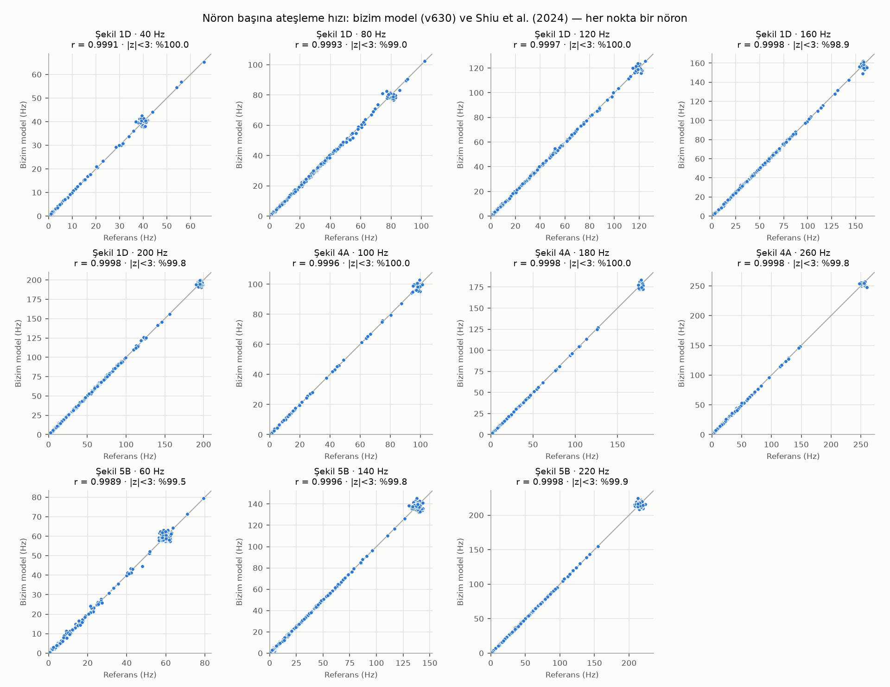
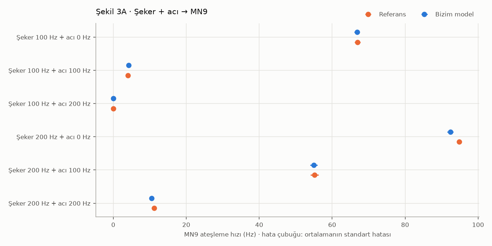
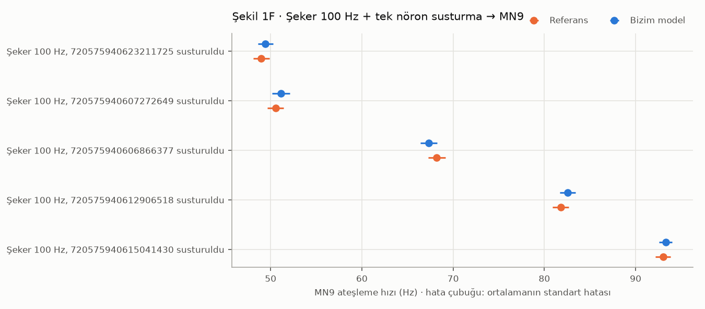
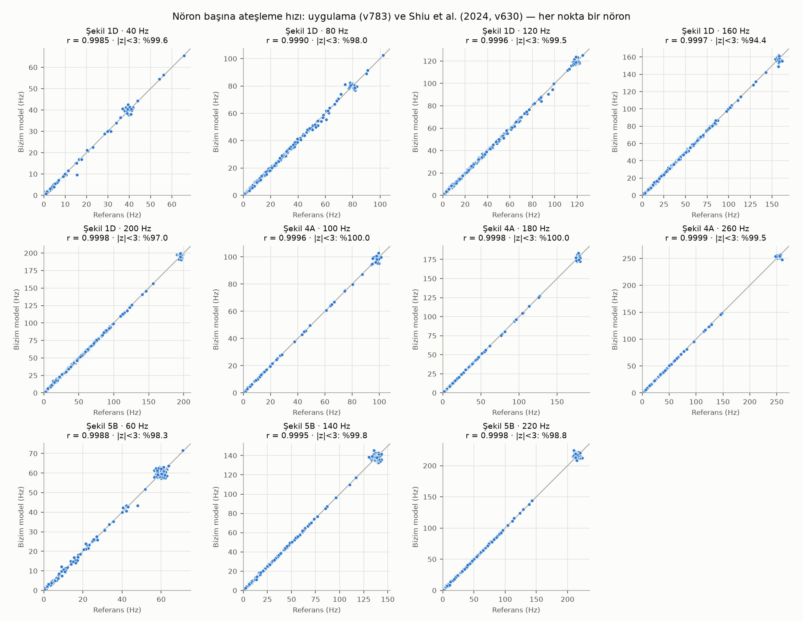

# Doğrulama Raporu

> Otomatik üretildi: `uv run sinek dogrula` · 2026-09-17

Bu rapor, projenin PyTorch LIF modelinin Shiu et al. (2024) [3] yayınlanmış sonuçlarını yeniden ürettiğini gösterir. Asıl doğrulama **makalenin kullandığı FlyWire v630 verisi ve makale kodundaki nöron kimlikleriyle** yapılır; böylece veri sürümü farkı sonuçlara karışmaz. Ek olarak uygulamanın kullandığı v783 verisiyle aynı deneyler tekrarlanarak sürüm farkının etkisi ölçülür (Bölüm 5).

**Model doğrulaması (v630): ✅ BAŞARILI**

## 1. Yöntem

Doğrulama iki katmanlıdır:

1. **Referans simülatörle birebir denklik** (`backend/tests/simulation/`): Rastgelelik içermeyen ağlarda spike zamanları Brian2 referans modeliyle **birebir** aynıdır; Poisson uyarımında ateşleme hızları istatistiksel olarak uyumludur.
2. **Yayınlanmış sonuçların yeniden üretimi** (bu rapor): Makalenin arşivlenmiş sonuç tabloları (doi:10.17617/3.CZODIW) ile tam beyin simülasyonlarımız karşılaştırılır.

Her deney 30 deneme × 1000 ms'dir (makaleyle aynı). Rastgele tohumlar farklı olduğu için sonuçlar spike düzeyinde değil **istatistiksel** olarak eşleşmelidir.

**Ölçütler.** Her nöron için Welch z skoru: z = (ort₁ - ort₂) / √((s₁² + s₂²)/(n - 1)). İki taraf aynı modeli temsil ediyorsa |z| < 3 oranı ≈ %99,7 beklenir. **Başarı ölçütleri:** tüm beyin deneylerinde r ≥ 0,99, |z| < 3 oranı ≥ %97 ve |z| > 5 olan nöron yok; tek nöron deneylerinde |z| < 4.

## 2. Tüm beyin karşılaştırması (v630)



| Deney | Şekil | Aktif nöron | Pearson r | Eğim | \|z\|<3 | \|z\|>5 | En büyük fark (Hz) | Toplam hız (bizim / ref.) |
|---|---|---|---|---|---|---|---|---|
| Şekere duyarlı GRN'ler 40 Hz → tüm beyin | 1D | 319 | 0.9991 | 1.004 | %100.0 | 0 | 3.1 | 1820 / 1803 |
| Şekere duyarlı GRN'ler 80 Hz → tüm beyin | 1D | 407 | 0.9993 | 0.998 | %99.0 | 0 | 6.6 | 7736 / 7748 |
| Şekere duyarlı GRN'ler 120 Hz → tüm beyin | 1D | 427 | 0.9997 | 1.003 | %100.0 | 0 | 5.5 | 11344 / 11317 |
| Şekere duyarlı GRN'ler 160 Hz → tüm beyin | 1D | 451 | 0.9998 | 1.000 | %98.9 | 0 | 8.5 | 14354 / 14361 |
| Şekere duyarlı GRN'ler 200 Hz → tüm beyin | 1D | 461 | 0.9998 | 1.002 | %99.8 | 0 | 6.6 | 16955 / 16925 |
| Suya duyarlı GRN'ler 100 Hz → tüm beyin | 4A | 100 | 0.9996 | 1.003 | %100.0 | 0 | 4.4 | 3340 / 3324 |
| Suya duyarlı GRN'ler 180 Hz → tüm beyin | 4A | 349 | 0.9998 | 0.999 | %100.0 | 0 | 7.5 | 6623 / 6624 |
| Suya duyarlı GRN'ler 260 Hz → tüm beyin | 4A | 470 | 0.9998 | 0.998 | %99.8 | 0 | 12.5 | 10387 / 10321 |
| Johnston organı nöronları 60 Hz → tüm beyin | 5B | 373 | 0.9989 | 0.999 | %99.5 | 0 | 5.1 | 10454 / 10477 |
| Johnston organı nöronları 140 Hz → tüm beyin | 5B | 653 | 0.9996 | 1.002 | %99.8 | 0 | 9.0 | 26383 / 26316 |
| Johnston organı nöronları 220 Hz → tüm beyin | 5B | 853 | 0.9998 | 1.000 | %99.9 | 0 | 11.5 | 43206 / 43172 |

## 3. Şeker ve acı etkileşimi (Şekil 3A, v630)



| Deney | Bizim model (Hz) | Referans (Hz) | z |
|---|---|---|---|
| Şeker 100 Hz + acı 0 Hz → MN9 | 66.8 ± 4.0 | 67.0 ± 4.3 | -0.12 |
| Şeker 100 Hz + acı 100 Hz → MN9 | 4.2 ± 2.8 | 4.0 ± 2.5 | +0.39 |
| Şeker 100 Hz + acı 200 Hz → MN9 | 0.0 ± 0.2 | 0.0 ± 0.2 | +0.00 |
| Şeker 200 Hz + acı 0 Hz → MN9 | 92.4 ± 4.5 | 94.9 ± 3.8 | -2.23 |
| Şeker 200 Hz + acı 100 Hz → MN9 | 55.0 ± 5.6 | 55.2 ± 6.0 | -0.13 |
| Şeker 200 Hz + acı 200 Hz → MN9 | 10.5 ± 3.1 | 11.2 ± 3.7 | -0.71 |

## 4. Susturma deneyleri (Şekil 1F, v630)



| Deney | Bizim model (Hz) | Referans (Hz) | z |
|---|---|---|---|
| Şeker 100 Hz, 720575940623211725 susturuldu → MN9 | 49.4 ± 4.5 | 49.0 ± 4.8 | +0.38 |
| Şeker 100 Hz, 720575940607272649 susturuldu → MN9 | 51.1 ± 5.3 | 50.5 ± 4.8 | +0.45 |
| Şeker 100 Hz, 720575940606866377 susturuldu → MN9 | 67.3 ± 5.0 | 68.2 ± 5.0 | -0.66 |
| Şeker 100 Hz, 720575940612906518 susturuldu → MN9 | 82.5 ± 4.6 | 81.8 ± 4.7 | +0.59 |
| Şeker 100 Hz, 720575940615041430 susturuldu → MN9 | 93.3 ± 3.9 | 93.0 ± 4.4 | +0.28 |

## 5. Uygulama verisiyle karşılaştırma (v783)

Aynı deneyler uygulamanın kullandığı **FlyWire v783 verisi ve uygulama nöron gruplarıyla** (`neuron_groups.toml`) tekrarlanmış, makalenin v630 sonuçlarıyla karşılaştırılmıştır. v630 → v783 arasında kimliği değişen referans nöronların ardılları FlyWire CAVE servisiyle belirlenmiştir ([veri.md](veri.md) bölüm 4.3); bu nedenle gruplar makaleyle aynı nöronları içerir. Bu bölüm, **uygulamanın makale sonuçlarını koruduğunu** gösterir. İki sürüm arasında bazı bağlantılar da düzeltildiği için küçük farklar beklenebilir. Tüm beyin karşılaştırması yalnızca iki sürümde aynı kimliğe sahip nöronlarla yapılır.

| Grup | v630 (makale) | v783 (uygulama) |
|---|---|---|
| Şekere duyarlı GRN | 21 | 21 |
| Acıya duyarlı GRN | 21 | 21 |
| Suya duyarlı GRN | 18 | 18 |
| Johnston organı | 146 | 146 |



| Deney | Şekil | Aktif nöron | Pearson r | Eğim | \|z\|<3 | \|z\|>5 | En büyük fark (Hz) | Toplam hız (bizim / ref.) |
|---|---|---|---|---|---|---|---|---|
| Şekere duyarlı GRN'ler 40 Hz → tüm beyin | 1D | 280 | 0.9985 | 1.002 | %99.6 | 1 | 6.0 | 1673 / 1674 |
| Şekere duyarlı GRN'ler 80 Hz → tüm beyin | 1D | 357 | 0.9990 | 0.997 | %98.0 | 1 | 6.6 | 7028 / 7067 |
| Şekere duyarlı GRN'ler 120 Hz → tüm beyin | 1D | 371 | 0.9996 | 0.998 | %99.5 | 0 | 4.8 | 10328 / 10370 |
| Şekere duyarlı GRN'ler 160 Hz → tüm beyin | 1D | 392 | 0.9997 | 0.998 | %94.4 | 0 | 8.5 | 13106 / 13178 |
| Şekere duyarlı GRN'ler 200 Hz → tüm beyin | 1D | 401 | 0.9998 | 0.999 | %97.0 | 2 | 6.9 | 15498 / 15546 |
| Suya duyarlı GRN'ler 100 Hz → tüm beyin | 4A | 96 | 0.9996 | 1.003 | %100.0 | 0 | 4.4 | 3233 / 3222 |
| Suya duyarlı GRN'ler 180 Hz → tüm beyin | 4A | 303 | 0.9998 | 0.999 | %100.0 | 0 | 7.5 | 6371 / 6395 |
| Suya duyarlı GRN'ler 260 Hz → tüm beyin | 4A | 393 | 0.9999 | 0.996 | %99.5 | 0 | 12.5 | 9844 / 9904 |
| Johnston organı nöronları 60 Hz → tüm beyin | 5B | 350 | 0.9988 | 0.998 | %98.3 | 0 | 5.1 | 10096 / 10108 |
| Johnston organı nöronları 140 Hz → tüm beyin | 5B | 560 | 0.9995 | 1.002 | %99.8 | 0 | 9.6 | 25310 / 25267 |
| Johnston organı nöronları 220 Hz → tüm beyin | 5B | 724 | 0.9998 | 1.000 | %98.8 | 1 | 14.6 | 41253 / 41253 |

### Şeker + acı → MN9 (v783)

| Deney | Bizim model (Hz) | Referans (Hz) | z |
|---|---|---|---|
| Şeker 100 Hz + acı 0 Hz → MN9 | 65.8 ± 4.2 | 67.0 ± 4.3 | -1.04 |
| Şeker 100 Hz + acı 100 Hz → MN9 | 5.4 ± 3.3 | 4.0 ± 2.5 | +1.93 |
| Şeker 100 Hz + acı 200 Hz → MN9 | 0.1 ± 0.3 | 0.0 ± 0.2 | +1.03 |
| Şeker 200 Hz + acı 0 Hz → MN9 | 92.4 ± 4.3 | 94.9 ± 3.8 | -2.30 |
| Şeker 200 Hz + acı 100 Hz → MN9 | 55.9 ± 5.8 | 55.2 ± 6.0 | +0.45 |
| Şeker 200 Hz + acı 200 Hz → MN9 | 11.4 ± 3.9 | 11.2 ± 3.7 | +0.23 |

### Susturma → MN9 (v783)

| Deney | Bizim model (Hz) | Referans (Hz) | z |
|---|---|---|---|
| Şeker 100 Hz, 720575940623211725 susturuldu → MN9 | 48.7 ± 5.0 | 49.0 ± 4.8 | -0.18 |
| Şeker 100 Hz, 720575940607272649 susturuldu → MN9 | 50.5 ± 4.6 | 50.5 ± 4.8 | +0.00 |
| Şeker 100 Hz, 720575940606866377 susturuldu → MN9 | 67.7 ± 5.6 | 68.2 ± 5.0 | -0.38 |
| Şeker 100 Hz, 720575940612906518 susturuldu → MN9 | 79.9 ± 4.9 | 81.8 ± 4.7 | -1.49 |
| Şeker 100 Hz, 720575940615041430 susturuldu → MN9 | 92.4 ± 5.3 | 93.0 ± 4.4 | -0.47 |

Susturma deneylerinde v783'te kimliği değişen nöronlar yerine CAVE ile doğrulanmış ardılları susturulmuştur (`experiments.py`, `V783_SILENCING_SUCCESSORS`).

## 6. Sınırlılıklar ve açıklamalar

- **Veri sürümü.** Model doğrulaması makalenin v630 verisiyle yapılmıştır; uygulama FlyWire v783 kullanır. v783'te kimliği değişen 3 referans nöronunun (şekere duyarlı 1, acıya duyarlı 1, Johnston organı 1) ardılları FlyWire CAVE ile belirlenip gruplara eklenmiştir. Ardıl kullanılmadığında şeker yolunda sistematik %5–9'luk bir düşüş ölçülmüştü; ayrıntı ve kontrol deneyi: [veri.md](veri.md) bölüm 4.3.
- **Susturma yöntemi.** Referans README'si susturmayı "giriş ve çıkış sinapslarının sıfırlanması" olarak tanımlar; referans kod yalnızca **çıkış** sinapslarını sıfırlar. Bu proje referans kodu izler.
- **Nöromodülatörler.** Dopamin, serotonin ve oktopamin referans modelde uyarıcı kabul edilir (basitleştirme).

## 7. Yeniden üretim

```bash
uv run sinek dogrula      # deneyleri çalıştırır (önbellekli), bu raporu yeniden yazar
```
